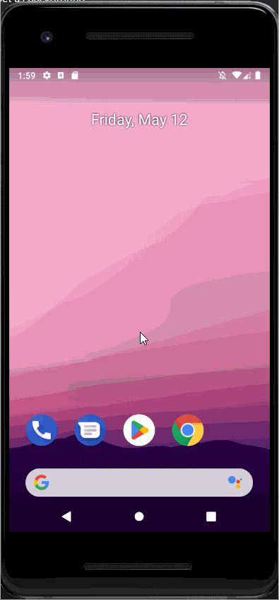
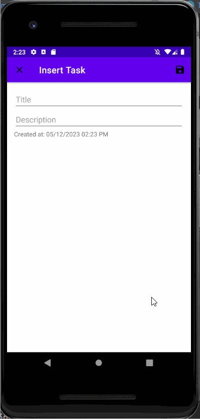
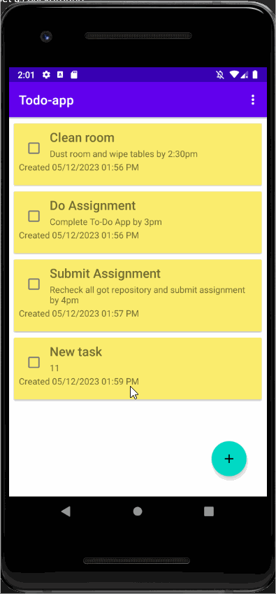
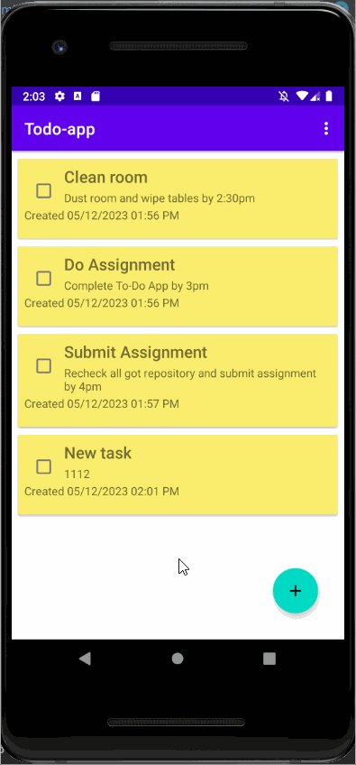

TODO APP
->The view after opening the todo app with already existing data.
Fig. 1

------CREATE NEW TASK------ 
->Adding new Task in the app.By clicking the floating plus button on the botton right a new activity is launched where we can insert new title and description for our new task. The id is auto generated and the created time is set to system time when the constructor is called and completed status is set to false.After filling all the fields save button is needed to be pressed on the top right corner.
Fig. 2 
  

------CREATE NEW TASK FAILED------ 
->If fields are left empty while inserting new task then it fails to create a new task as the toast message relays the message at the bottom.
Fig. 3 
  

------EDIT TASK------ 
->To update the existing task just click on the item then the same insert activity which was used for adding new task is opened with different title at top with populated data fields.After updating task save it. The created time also changes according to which time the task was updated.
Fig. 4 
  

------DELETE ONE TASK------ 
->Deleting a particular task , you can swipe the task from left to right or vice versa.You can undo the delete action by pressing the undo button and restore the task.
Fig. 5 
  

------SORT TASK BY TITLE------ 

