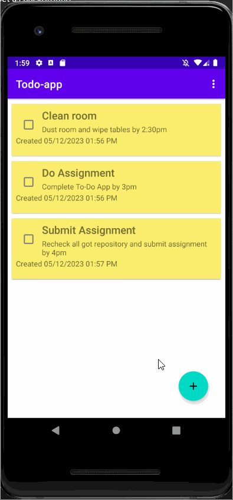

TODO APP 
->The view after opening the todo app with already existing data. 
Fig. 1  

   

------CREATE NEW TASK------ 
->Adding new Task in the app.By clicking the floating plus button on the botton right a new activity is launched where we can insert new title and description for our new task. The id is auto generated and the created time is set to system time when the constructor is called and completed status is set to false.After filling all the fields save button is needed to be pressed on the top right corner. 
Fig. 2  
   

------CREATE NEW TASK FAILED------ 
->If fields are left empty while inserting new task then it fails to create a new task as the toast message relays the message at the bottom. 
Fig. 3  
   

------EDIT TASK------ 
->To update the existing task just click on the item then the same insert activity which was used for adding new task is opened with different title at top with populated data fields.After updating task save it. The created time also changes according to which time the task was updated. 
Fig. 4  
   

------DELETE ONE TASK------ 
->Deleting a particular task , you can swipe the task from left to right or vice versa.You can undo the delete action by pressing the undo button and restore the task. 
Fig. 5  
   

------SORT TASKS BY TITLE------ 
->To sort task aplhabetically according to its title an option in the menu is available which sorts the task in ascending order accoring to the title. 
Fig. 6  
   

------HIDE COMPLETED TASKS------ 
->The task which are checked/completed can be hidden. The menu item is available which allows us to hide completed task/s. 
Fig. 7  
   

------SHOW ALL TASKS------ 
->The task which are checked/completed which had been hidden can again be displayed. The menu item is available which allows us to show all tasks again. 
Fig. 8  
   

------DELETE COMPLETED TASK------ 
->The task which are checked/completed can be delete. The menu item is available which allows us to delete completed task/s. 
Fig. 9  
   

------ABOUT FRAGMENT------ 
->The about app fragment is available which gives a brief on the app. The menu item is available which allows us to go to the about fragment and we can return to main activity again using the previous button. 
Fig. 10  
   

------ROTATING APP------ 
->The app works as normally even when the screen is rotated.All functions work perfectly 
Fig. 11  
   

------DATA STORED------ 
->The app stores the data even when we exit from the app, we can get the stored data on opeing the app again. 
Fig. 12  
   

------DELETE ALL TASK------ 
->All the tasks can be deleted at once. The menu item is available which allows us to delete all tasks. 
Fig. 13  
   